## 前言

本篇旨在为iOS开发尚未入门的同学提供一些基本的指引，但仍要求你具备最基本的C语言以及Objective-C编程常识。

刨根问底是一个好习惯，它是一个优秀软件工程师的基本素养，但是对于编程新手来说，我们不必问太多的为什么，只需要跟着做，也许你一开始迷迷糊糊，多一点耐心和虚心，其中的真意最终都会渐渐显露。

## 新建一个iOS应用工程

打开苹果为我们提供的开发工具——Xcode。

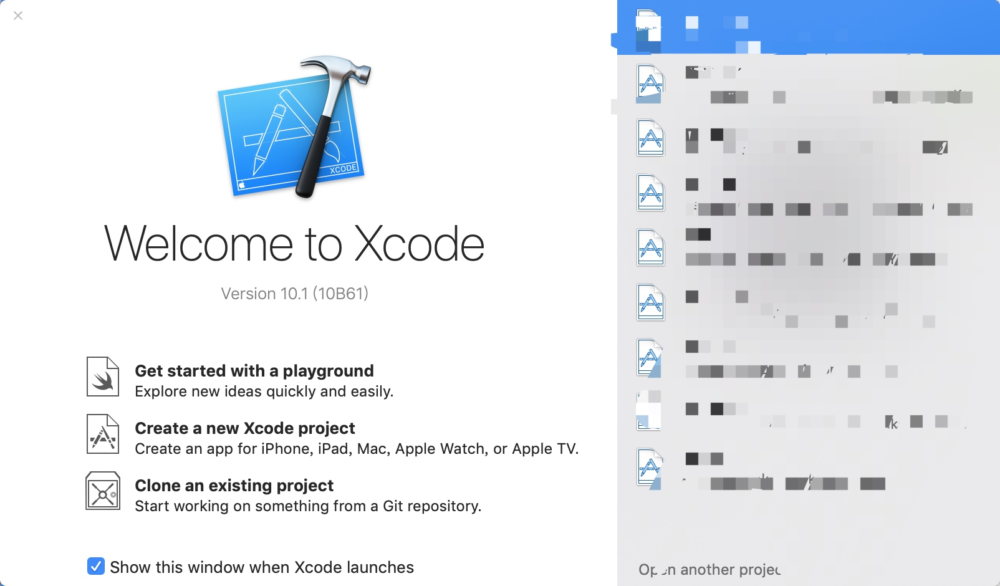

点击"Create a new Xcode project"，意为“创建一个新的Xcode工程”。

接下来会弹出一个工程模板界面。

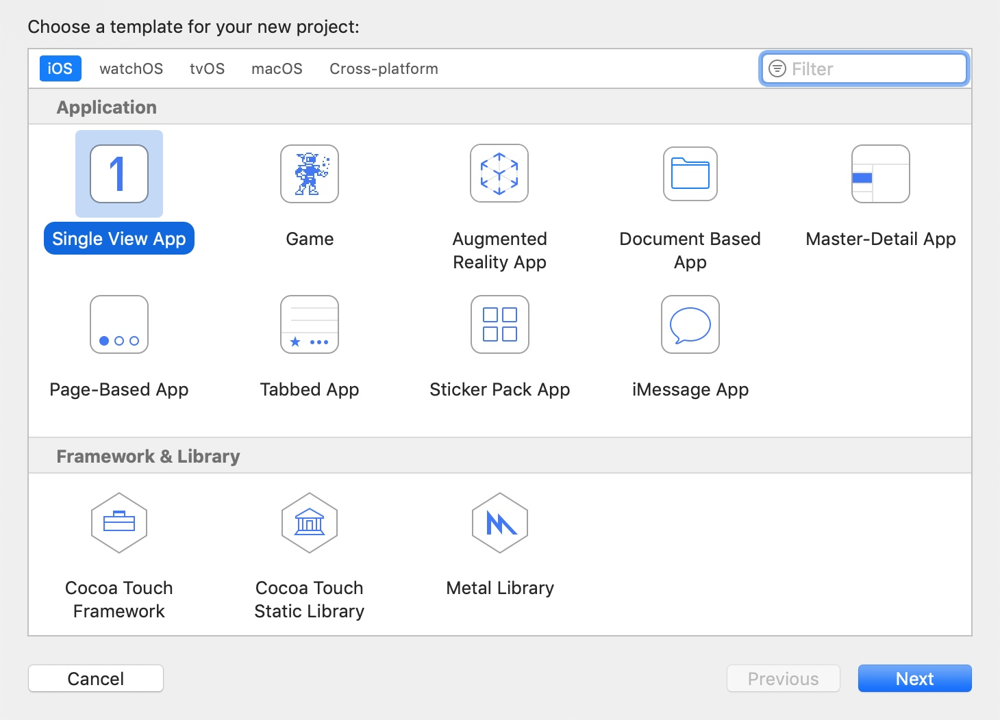

此处选择iOS下的"Single View App"，意为"单视图应用"，点击next，来到工程设置界面。

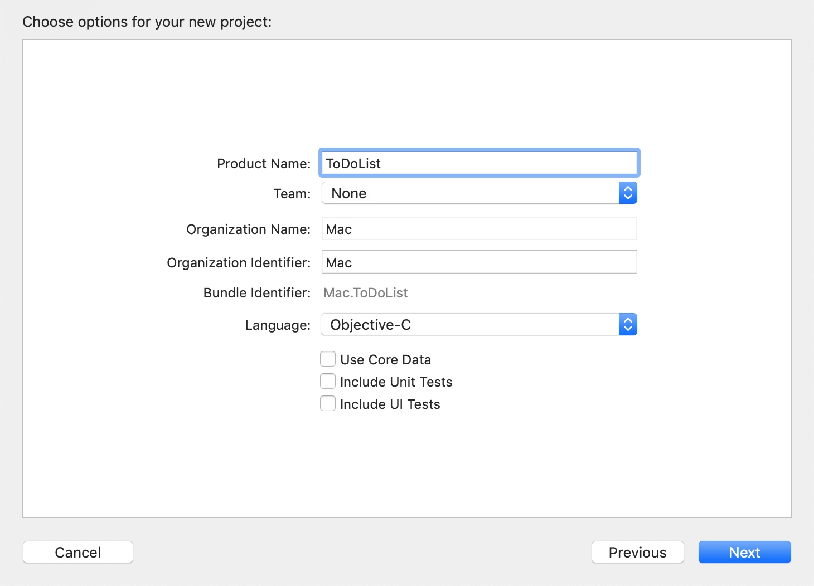

这个界面的众多选项目前我们不必一一深究，在Product Name下填入工程名称，将Language设置为Objective-C后即可点击next，选择工程存放的位置后，便完成了工程的创建。

如果勾选了下面的Source Control，那么Xcode会自动将工程加入到自带的**Git**的版本控制中，无论你是否了解，都建议勾选上，不懂的同学以后可以了解一下Git的使用方法~

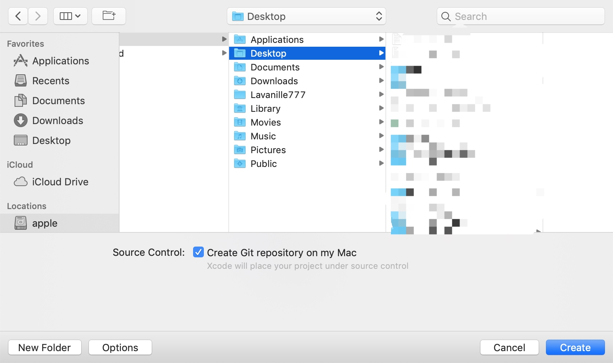

接下来我们正式进入到Xcode的主界面。

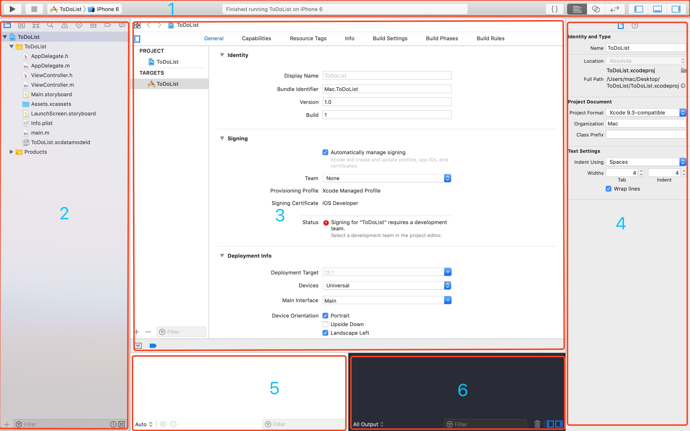

1：顶栏（我也不知道这个该叫啥2333，总之它不会消失就是了）
2：导航栏 (navigator)
3：编辑区
4：检测栏 (inspector)
5：调试区——变量视图
6：调试区——控制台

如果你看到的界面和我的不一样，那么有可能是某些区域被隐藏起来了，其中导航栏，检测栏，调试区三大区域的隐藏与显示由**顶栏最右侧的三个按钮**控制，而调试区的两个部分的显示与隐藏则在**调试区右下角**控制。

## 认识 iOS 工程

简单的熟悉了一下界面后，就暂且不要再继续深究每个按钮的作用了，让我们把注意力转移到左侧的导航栏中，这里展示的是当前工程的目录。

系统为我们创建了两个文件夹，其中一个以**当前的工程**命名，另外一个叫做Product，其下只有一个.app文件，这个就是我们的工程编译完成后的应用文件。

重点在第一个文件夹下，接下来我们从程序运行的角度来认识一下这些文件。
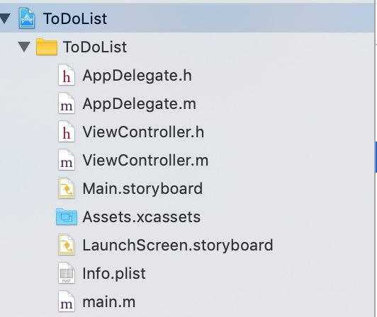

大家应该知道在C语言中，程序在运行之初会调用main函数，因此我们先进入到main.m中瞧一瞧。

### main.m

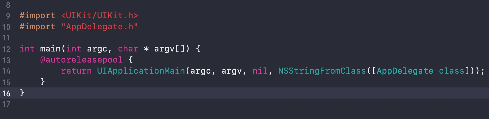

如图所示，在main.m文件中导入了两个非常重要的头文件

- UIKit/UIKit.h
- AppDelegate.h

其一是官方提供的iOS开发框架，我们日后会详细了解，其二是在导航栏中看到的文件。

接下来便是一个main函数，在这之中只调用了一个方法

- UIApplicationMain

**我们按住command，将光标移动到UIApplicationMain函数上，单击左键。**

此时会弹出一个菜单。
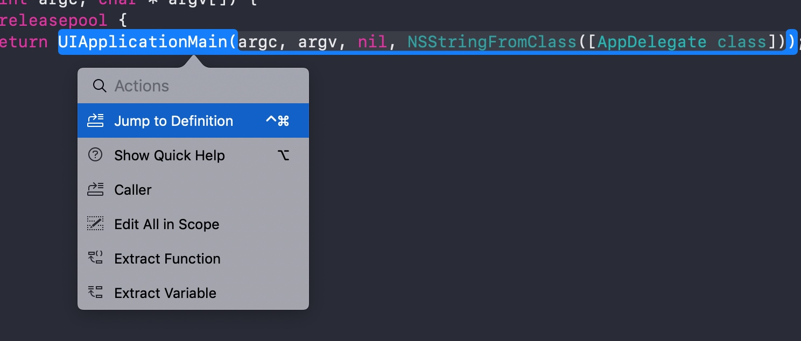

点击Jump to Definition，即跳转到定义（留意，这是一个常用操作）。

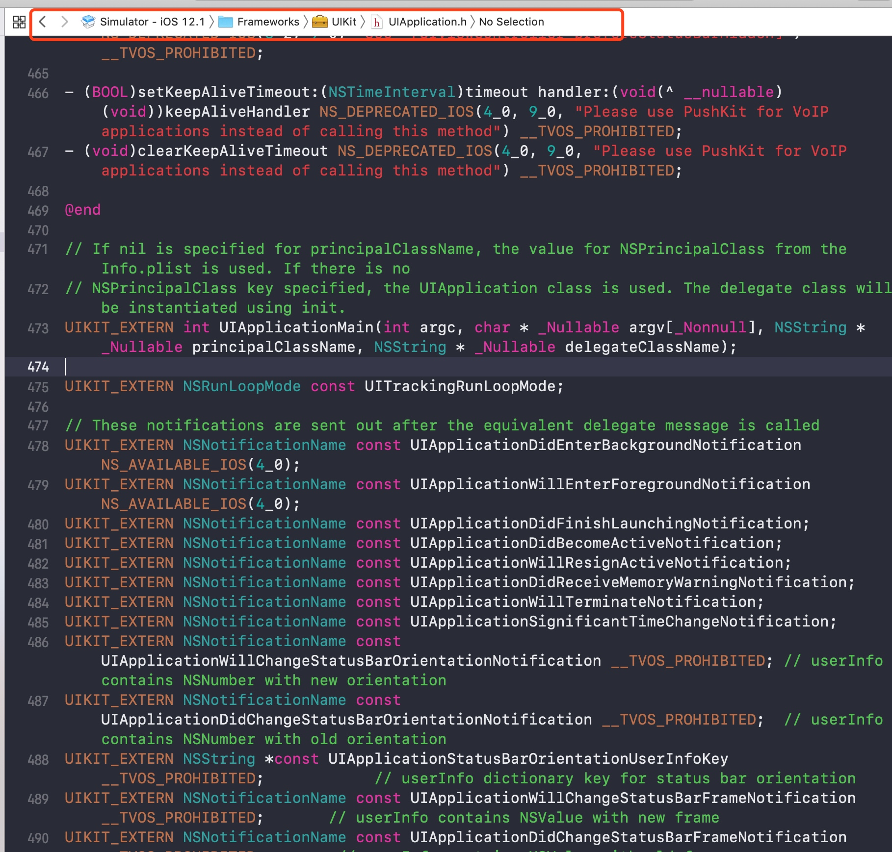

注意看UIApplicationMain上方的注释，它提示了这个函数主要做的两件事。

1. 当principalClassName（即第三个参数）为nil时，NSPrincipalClass的值将从Info.plist中获取，如果在那里面没有定义NSPrincipalClass的值，那么它的值将从UIApplication类中获取。
2. 初始化delegate类。

目前我们只需要知道，应用在运行时，首先要从Info.plist文件中获取某些配置，再初始化代理类，也就是main.m中传入的AppDelegate。

### Info.plist

Info.plist的本质是一个XML文件，它包含了一系列应用运行相关的配置，暂时无需关注，我们来看AppDelegate类。

### AppDelegate

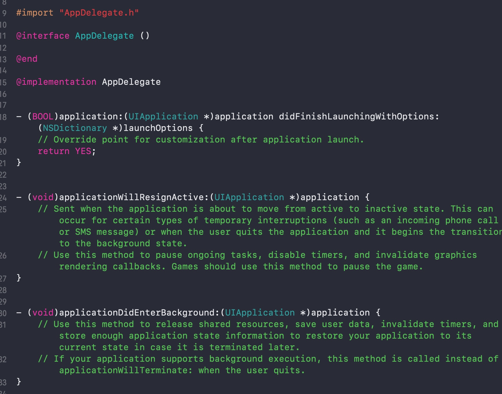

AppDelegate.m下写了一大堆代理回调方法，不要害怕，只需要一点点的英语基础，仔细看，每个回调方法的名称都是程序运行周期中不同阶段的名称。有关程序运行周期的要点我们以后再提，这里我们只需要知道可以在AppDelegate里处理程序生命周期各个阶段的事务。

### Assets.xcassets

用于管理和存放图片资源，这里可不是简单的文件夹哦，关于它的使用方法我们以后再提。

## 使用纯代码编写页面

我们已经稍微了解了工程文件夹下的大部分文件，对于iOS开发的陌生感有没有减少一点呢？还剩下Main.storyboard，LaunchScreen.storyboard，以及ViewController这三个文件没有提到，不要着急，马上就可以上手了。

Xcode为我们提供了两种页面的编写方式，一种是可视化的方式，也就是在storyboard里通过拖拽控件进行页面布局，另一种是使用纯代码编写。

对于入门的iOS开发者，我强烈建议从纯代码入手，这样不仅利于自己的成长，而且纯代码开发对于团队合作也十分有利，可视化开发可以在今后的学习中自行了解。接下来让我们准备用纯代码开始。

### 第一步，删除Main.storyboard
在Main.storyboard上点击右键，选择delete，弹出如下界面。

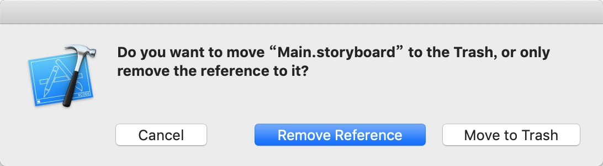
中间的按钮（Remove Reference）代表仅解除文件和工程之间的关联，**但文件本身还存在于工程文件夹中**，右侧的按钮（Move to Trash）不仅会解除关联，还会将Main.storyboard扔进废纸篓，因为我们肯定不需要Main.storyboard了，所以将它扔进废纸篓吧。

### 第二步，删除工程中的主界面配置

点击导航栏中的工程文件，找到右侧的Main Interface，删去框框里的Main。


### 第三步，在AppDelegate.m里配置启动页面

来到AppDelegate.m下，找到didFinishLaunchingWithOptions这个回调方法，意为**程序完成启动时**。

我们在这个方法里写上如下三句话。

```
    self.window = [[UIWindow alloc]initWithFrame:[UIScreen mainScreen].bounds];
    
    self.window.rootViewController = [[ViewController alloc]init];
    
    [self.window makeKeyAndVisible];
```

即

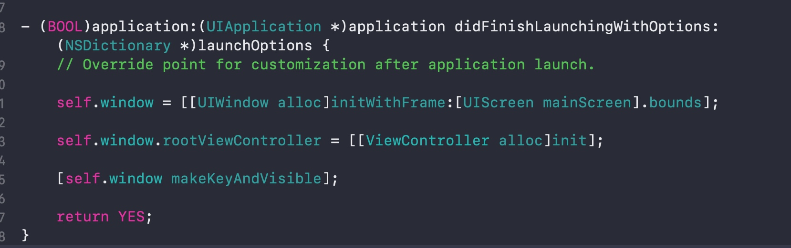

注意看到第二句话，我们将ViewController作为了程序的根视图控制器，这意味着进入程序后看到的第一个视图界面就是ViewController，那么就让我们运行试试吧。

## 运行工程


在Xcode左上角选择运行的设备，这里我们选择iPhone 6的模拟器，然后点击最左侧的运行按钮，或者是使用command + R的组合键，程序就开始运行了。

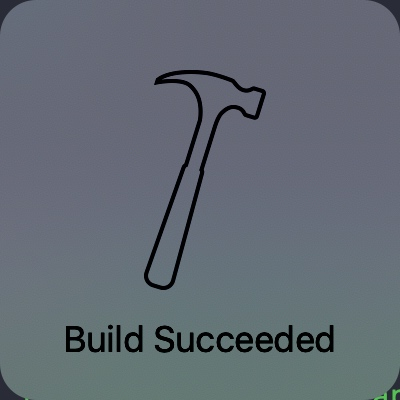

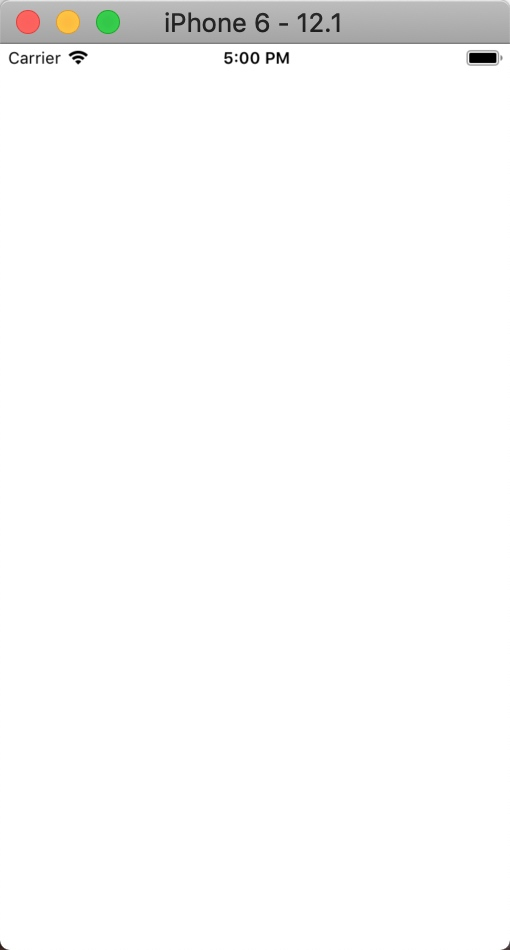

运行成功~ 这里就是我们的ViewController界面，它还是一片空白，因为我们还什么都没有写，但是可喜可贺，你已经坚持做到这里来了，万事开头难，先休息或者回顾一下这一篇的知识点，下一篇我们再来谈一谈什么是**视图控制器（UIViewController）**

## 本篇到此为止，希望这对你有帮助，如果有错误或是有需要补充的地方，望告知。


