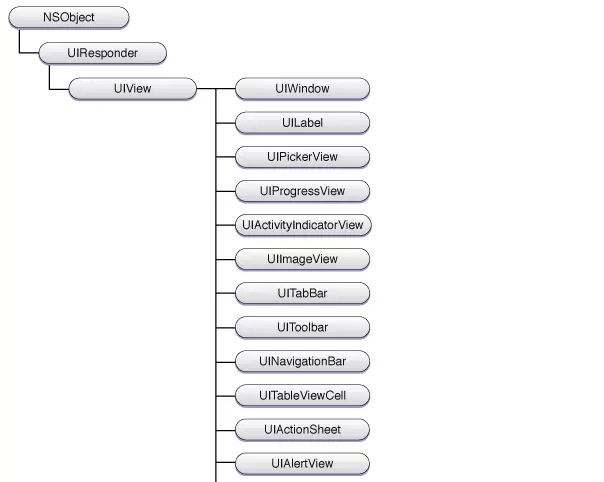

## 什么是UIView
在iOS开发中，UIView就是我们常说的视图，它是程序窗口中的一块矩形区域，iOS中几乎所有的控件都是UIView的子类，UIView的基本任务是负责渲染某一块区域的内容，以及响应这一块
区域的触摸事件。


## UIView的常用属性

### @property(nonatomic) CGRect frame;

CGRect是一种iOS SDK定义的结构体。

```
struct CGRect {
    CGPoint origin;
    CGSize size;
};
```

其中还包含CGPoint和CGSize两种结构体

```
struct CGPoint {
    CGFloat x;
    CGFloat y;
};

struct CGSize {
    CGFloat width;
    CGFloat height;
};
```

CGFloat是单精度和双精度浮点数类型的宏定义，在32位环境下CGFloat为单精度，而在64位环境下则为双精度。

那么回到这个frame属性，它定义了UIView相对于父视图的位置和自身的大小，origin是以父视图左上角为原点的坐标属性，而size则是自身的大小。


