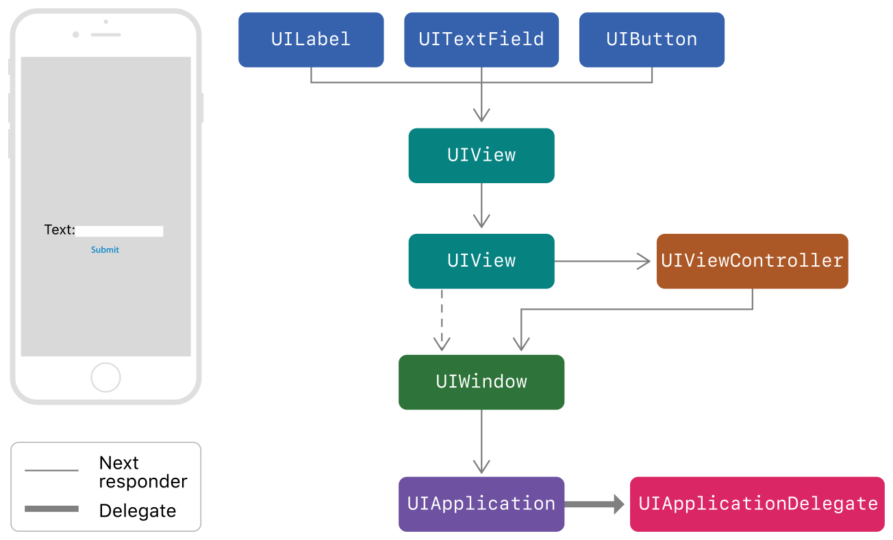

很多博客都有写到有关iOS响应链的话题，但大多千篇一律，也不够全面，从触摸开始到应用响应事件的过程里，响应链只占其中一小部分，甚至也可能完全不会经过响应链。经过接近一天时间的探索，我大概弄明白了一些关于触摸事件响应的过程，且听我一一道来。

## UIEvent（事件）

事件在iOS开发中以UIEvent的形式存在，它直接继承自NSObject，分为以下四种：

+ UIEventTypeTouches, //触摸事件类型 通过触摸屏幕触发
+ UIEventTypeMotion, //摇晃事件类型 通过陀螺仪加速度计触发
+ UIEventTypeRemoteControl, //遥控事件类型 通过蓝牙或网络触发
+ UIEventTypePresses NS_ENUM_AVAILABLE_IOS(9_0), //按压事件类型 通过按压屏幕触发（压感，以后估计没有了）

本篇仅针对触摸事件讨论，当用户触摸到屏幕时，经过硬件的一系列处理，应用会收到一个触摸的UIEvent，其中包含着一个名为allTouches的UITouch数组，而UITouch则是触摸的一个基本单位，其中包含着触摸的时间，位置，次数等等信息，那么应用中具体是谁会收到UIEvent呢?

## UIResponder（响应者）
一切可以响应事件的对象都继承自UIResponder，也可称之为响应者，UIResponder的直接子类有三个：

+ UIApplication
+ UIView
+ UIViewController

UIApplication也就是我们的应用本身，是最高级的响应者，它是事件传递的起点，以及响应的终点。而UIView和UIViewController及它们的众多子类构成了iOS的响应者控件家族。

## 第一响应者（first responder）

也就是应该响应事件的对象，在触摸事件中，第一响应者在用户看来就是他触碰的那个视图。

## 事件的传递链（hitTest链条）

那么我们现在明白了事件的发生者和接受者，这中间又是如何传递的呢。
当触摸事件被硬件识别后，它会将其交给UIApplication，其底层管理着一个事件队列，UIApplication会将事件出队，用sendEvent方法传递给UIWindow，UIWindow是所有视图的根视图，它的父视图是nil，同时它也是一个UIView，从这里起就要使用个一个UIView的实例方法来寻找第一响应者，这个方法就是
```
- (UIView *)hitTest:(CGPoint)point withEvent:(UIEvent *)event
```
通过传入触摸事件，返回第一响应者，尽管苹果并没有开源，但它的内部实现已经被验证了很久了，先贴出来

```
-(UIView *)hitTest:(CGPoint)point withEvent:(UIEvent *)event{
    if(self.userInteractionEnabled == NO || self.hidden == YES || self.alpha <= 0.01) {
        return nil;
    }
    
    if (![self pointInside:point withEvent:event]) {
        return nil;
    }

    int count = (int)self.subviews.count;
    for (int i = count - 1; i >= 0; i--) {
        UIView *chileV =  self.subviews[i];
        CGPoint childP = [self convertPoint:point toView:chileV];
        UIView *fitView = [chileV hitTest:childP withEvent:event];
        if(fitView){
            return fitView;
        }
    }
    
    return self;
    
}
```

1. 先判断self.userInteractionEnabled == YES && self.hidden == No && self.alpha > 0.01这三个条件是否符合。
2. 再判断触摸事件是否发生在自身范围内。
3. 如果这些都没问题，已经可以确定至少自身可以响应事件，但还需要看自己有没有子视图，如果有，则倒序遍历子视图数组，递归hitTest的过程，如果没有子视图，或子视图中没有第一响应者则返回自身。

找到第一响应者后，再来处理事件。

以下用**hitTest视图**或**第一响应者**指代hitTest最终返回的视图。

> 疑点:单次点击事件会触发两次hitTest调用，苹果的官方说法是在两次调用间系统可能会调整point的位置，但尚且不知道它的具体作用。

## 处理触摸事件

在iOS中我们通常用以下两套系统来处理触摸事件:

### UIControl

UIControl是UIView的直接子类，它的子类包括UIButton,UISwitch,UITextFiled等一系列常用的可以响应触摸事件的控件。通过Target-Action的模式绑定一个函数来处理一系列的UIControlEvent。

当事件传来，首先触发UIView的

```
//手指接触屏幕时
- (void)touchesBegan:(NSSet<UITouch *> *)touches withEvent:(UIEvent *)event
```

根据绑定的action的UIControlEvent不同会在以下四个阶段将事件传递给target

```
//手指在屏幕上移动时
- (void)touchesMoved:(NSSet<UITouch *> *)touches withEvent:(UIEvent *)event

//手指离开屏幕时
- (void)touchesEnded:(NSSet<UITouch *> *)touches withEvent:(UIEvent *)event

//触摸被系统中断时，例如来电，锁屏等
- (void)touchesCancelled:(NSSet<UITouch *> *)touches withEvent:(UIEvent *)event
```

比如点按事件在touchesEnded阶段才被发送出去，而拖拽事件则在touchesMoved阶段就发送出去了。

而如果没有指定target，事件会进入**响应链(responder chain)**，这个后面会讨论。

### UIGestureRecongnizer（手势识别器）

UIGestureRecongnizer是优先级高于UIControl且可以识别更多手势的对象，在UIView中可以通过addGestureRecognizer为其添加手势识别器，也是通过Target-Action的模式来响应事件。

当事件传来时，手势识别器会按顺序回调以下几个代理方法:

```
///事件传来时(iOS13.4之后加入，暂时不知道它的具体作用)
- (BOOL)gestureRecognizer:(UIGestureRecognizer *)gestureRecognizer shouldReceiveEvent:(UIEvent *)event

///触摸传来时
- (BOOL)gestureRecognizer:(UIGestureRecognizer *)gestureRecognizer shouldReceiveTouch:(UITouch *)touch

///手势即将识别
- (BOOL)gestureRecognizerShouldBegin:(UIGestureRecognizer *)gestureRecognizer
```

关于这两套系统的事件传递顺序，我们先来看苹果的说明。

## 苹果的说明

```
Controls communicate directly with their associated target object using action messages. 
When the user interacts with a control, the control sends an action message to its target object. 
Action messages are not events, but they may still take advantage of the responder chain. 
When the target object of a control is nil, UIKit starts from the target object and traverses the responder chain until it finds an object that implements the appropriate action method. 
For example, the UIKit editing menu uses this behavior to search for responder objects that implement methods with names like cut(_:), copy(_:), or paste(_:).

Gesture recognizers receive touch and press events before their view does. 
If a view's gesture recognizers fail to recognize a sequence of touches, UIKit sends the touches to the view. 
If the view does not handle the touches, UIKit passes them up the responder chain. 
For more information about using gesture recognizer’s to handle events, see Handling UIKit Gestures.
```

大意是 “Controls是通过action直接与其关联的target通信的，当指定的target存在时，Controls直接在target中寻找action来调用，但如果target为nil，事件开始进入响应链来寻找实现了action的对象。

Gesture recognizers会比UIView更早收到触摸事件，如果手势识别失败，触摸事件则会传递给视图，如果视图没有处理触摸事件**（即没有重写touchesBegan系列方法）**，则事件进入响应链。”

根据苹果的意思，UIGestureRecongnizer拥有更高的优先级，经过我的验证，在添加了GestureRecongnizer的UIView上会先触发shouldReceiveEvent，shouldReceiveTouch，之后才会触发touchesBegan，对于UIControl来说，当手势识别结束触发Action后，才完成UIControl的事件识别，触发相应的Action。

另外，如果在UIControl上添加UIGestureRecongnizer，它将只会响应UIGestureRecongnizer的手势，但可以将UIGestureRecongnizer的cancelsTouchesInView设置为NO, 即可将事件传递给UIControl自身。

> 疑点：根据官方文档中的解释，似乎是只有在手势识别失败的情况下事件才会传递给view，但在我的实验中无论手势识别失败成功，view的touchesBegan都会被触发，而且是在手势开始识别之前。

## 响应链（responder chain）

还是先看苹果的说明：

```
Unhandled events are passed from responder to responder in the active responder chain, 
which is the dynamic configuration of your app’s responder objects. 
Figure 1 shows the responders in an app whose interface contains a label,
a text field, a button, and two background views.
The diagram also shows how events move from one responder to the next, following the responder chain.
If the text field does not handle an event, UIKit sends the event to the text field’s parent UIView object, followed by the root view of the window. 
From the root view, the responder chain diverts to the owning view controller before directing the event to the window.
If the window cannot handle the event, UIKit delivers the event to the UIApplication object, and possibly to the app delegate if that object is an instance of UIResponder and not already part of the responder chain.
```


其实意思很简单，当hitTest返回的第一响应者为**一般UIView**（这个稍后讨论），且第一响应者无法处理事件时，会向下一个响应者传递，对于UIView而言就是向它的父视图传递，如果UIViewController的view无法处理，就会传给UIViewController处理，如果UIViewController无法处理则会传递给其View的父视图，一直传递到UIWindow，由于UIWindow没有父视图，当它无法处理时会最终传递到UIApplication及UIApplicationDelegate。

做一个简单Demo
```
    UIView *view0 = [[UIView alloc]init];
    view0.backgroundColor = [UIColor blackColor];
    UITapGestureRecognizer *tap1 = [[UITapGestureRecognizer alloc]initWithTarget:self action:@selector(touchAction)];
    [view0 addGestureRecognizer:tap1];

    [self.view addSubview:view0];
    [view0 mas_makeConstraints:^(MASConstraintMaker *make) {
        make.center.mas_equalTo(self.view);
        make.width.height.mas_equalTo(500);
    }];
    
    UIView *view1 = [[UIView alloc]init];
    view1.backgroundColor = [UIColor grayColor];
    [view0 addSubview:view1];
    [viewB1 mas_makeConstraints:^(MASConstraintMaker *make) {
        make.center.mas_equalTo(self.view);
        make.width.height.mas_equalTo(80);
    }];
```

view0是view1的父视图，其上有一个单击手势，而view1上没有手势，在view1上点击时hitTest最终返回的视图是view1，但它并不能处理单击手势，则会将事件传递给view0，最后view0响应了这个事件，**要注意的是响应链是寻找父视图，因此仅仅只是将view1放在view0的上层是没用的，view1必须要是view0的子视图才行。**

### UIControl的响应链

另外一种响应链触发情况是关于UIControl的，如上述苹果说明，例如

```
    UIButton *btn = [[UIButton alloc]init];
    [btn addTarget:nil action:@selector(btnTouchAction) forControlEvents:UIControlEventTouchUpInside];
    btn.backgroundColor = [UIColor greenColor];
    [self.view addSubview:btn];
    [btn mas_makeConstraints:^(MASConstraintMaker *make) {
        make.center.mas_equalTo(self.view);
        make.width.height.mas_equalTo(50);
    }];
```

这里并没有设置target, 亦或是target中途被销毁，事件会从btn起沿着响应链向上找到viewController中的btnTouchAction而响应，**这种规则在Gesture中并不存在，如果gesture的target设为nil，则不能找到相应的action。**

## 响应链的特殊情况（存疑）

上面提到响应链触发的条件是“当hitTest返回的第一响应者为**一般UIView**,且第一响应者无法处理事件时”，这样说是因为本人在测试过程中发现UIControl下的UIButton，UISegmentControl，UISlider这几个控件**作为第一响应者时**是无法传递响应链的，如果他们不是第一响应者，而是出现在响应链中间，也不会响应自身的关联的action，而是继续寻找可以处理手势的view，但如果它们本身也添加了手势，那么是可以响应的。

这个情况有一些复杂，但确实是我本人测出的真实情况，大家也可以验证一下，目前还没有探明原因。

## UIGestureRecongnizer的cancelTouches行为

在第一个UIGestureRecongnizer识别了手势之后，也就是
```
- (BOOL)gestureRecognizerShouldBegin:(UIGestureRecognizer *)gestureRecognizer
```
返回true之后，和这个手势事件相关的hitTest视图以及其他手势均会收到cancelTouches的消息，也就是不再响应这个手势，并且相关view会回调
```
- (void)touchesCancelled:(NSSet<UITouch *> *)touches withEvent:(UIEvent *)event
```
这个方法。

但如果想要让一个手势事件同时被多个手势识别器响应，可以使用Gesture的以下代理回调

```
- (BOOL)gestureRecognizer:(UIGestureRecognizer *)gestureRecognizer shouldRecognizeSimultaneouslyWithGestureRecognizer:(UIGestureRecognizer *)otherGestureRecognizer{
    return  true;
}
```

返回true代表UIGestureRecongnizer在识别手势后不会向其他手势识别器发送cancelTouches消息。

但对于hitTest视图依然会发送cancelTouches消息，即在UIButton上添加手势时，单击手势被识别后，由于UIButton的事件识别依赖于UIView本身的touchesBegan等一系列流程，而收到cancelTouches消息后，这个流程被中断了，因此UIButton本身的touchUpInsideEvent就不会响应了，类似的还有collectionView,tableView的didSelect回调，也是依赖于UIView的touchesBegan系列方法来识别，如果在它们的父视图或子视图上添加手势，didSelect回调将不会响应。
如果想要让手势不向UIView发送cancelTouches消息，可以设置UIGestureRecongnizer的cancelsTouchesInView为NO，表示不会向视图发送cancelTouches消息。

## 本篇到此为止，希望这对你有帮助，如果有错误或是有需要补充的地方，望告知。


