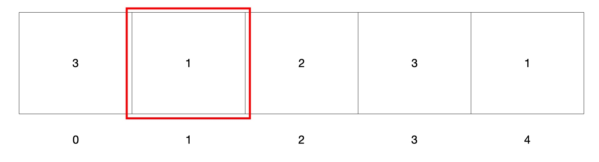

## 特性

支持定时自动轮播，可选纵向和横向。

## Github

https://github.com/Lavanille777/LJBannerView

## 用例

```
class ViewController: UIViewController, LJBannerViewDelegate {

    var bannerView: LJBannerView = LJBannerView()
    
    var bannerViewReuseIdentifier: String = "bannerView"
    
    override func viewDidLoad() {
        super.viewDidLoad()
        view.backgroundColor = .white
        bannerView.delegate = self
        bannerView.frame = CGRect(x: (view.frame.width - 345)/2 , y: (view.frame.height - 195)/2, width: 345, height: 195)
        bannerView.registView(UIImageView.self, forViewWithReuseIdentifier: bannerViewReuseIdentifier)
        bannerView.showIndicator = true
        bannerView.startRollingLoop(withTimeInterval: 2)
        view.addSubview(bannerView)
    }
    
    
    func bannerView(_ bannerView: LJBannerView, viewAt index: Int) -> UIView {
        let view = bannerView.dequeueView(withReuseIdentifier: bannerViewReuseIdentifier) as! UIImageView
        view.image = UIImage(named: "img\(index + 1)")
        return view
    }
    
    func bannerView(numberOfViewsIn bannerView: LJBannerView) -> Int {
        return 5
    }


}
```

## 核心思路

总体来说是对UICollectionView的一个包装，在要显示的cells基础上前后各增加一个过渡用的cell。

如下：



当collectionView滚动到0和4的时候，分别重定位contentOffset到3和1的位置，即可实现无限轮播。

## 实现

首先实现便利构造器

```
convenience init() {
    self.init(frame: .zero)
}
```

调用一个自定义的构造方法

```
init(frame: CGRect = .zero, scrollDirection: UICollectionView.ScrollDirection = .horizontal)
```

在构造方法里初始化私有成员collectionView，以及添加上对frame的kvo。最后调用setupUI方法，用来应用frame的修改。

```
private func setupUI(){
        collectionView.frame = self.bounds
        collectionView.contentOffset = flowLayout.scrollDirection == .horizontal ? CGPoint(x: self.frame.width, y: 0) : CGPoint(x: 0, y: self.frame.height)
        indicatorV.frame = CGRect(x: 0, y: self.frame.height - 20, width: self.frame.width, height: 20)
        for queue in reuseQueues.values{
            for view in queue{
                view.frame = self.bounds
            }
        }
    }
```

然后实现collectionView的代理回调。

```
protocol LJBannerViewDelegate {
    
    func bannerView(_ bannerView: LJBannerView, didSelectItemAt index: Int)
    
    func bannerView(_ bannerView: LJBannerView, viewAt index: Int) -> UIView
    
    func bannerView(numberOfViewsIn bannerView: LJBannerView) -> Int
    
}

    func reloadData(){
        if let delegate = delegate {
            dataCount = delegate.bannerView(numberOfViewsIn: self)
            collectionView.isScrollEnabled = dataCount > 1
            indicatorV.isHidden = !showIndicator || dataCount <= 1
            indicatorV.numberOfPages = dataCount
            indicatorV.pageIndicatorTintColor = pageIndicatorTintColor
            indicatorV.currentPageIndicatorTintColor = currentPageIndicatorTintColor
        }
        collectionView.reloadData()
    }
    
    func collectionView(_ collectionView: UICollectionView, layout collectionViewLayout: UICollectionViewLayout, sizeForItemAt indexPath: IndexPath) -> CGSize {
        return self.frame.size
    }
    
    func collectionView(_ collectionView: UICollectionView, numberOfItemsInSection section: Int) -> Int {
        return dataCount + 2
    }
    
    func collectionView(_ collectionView: UICollectionView, cellForItemAt indexPath: IndexPath) -> UICollectionViewCell {
        
        let cell = collectionView.dequeueReusableCell(withReuseIdentifier: "bannerCell", for: indexPath)
        
        guard let delegate = delegate else {
            return cell
        }
        
        var index = 0
        if indexPath.item == 0{
            index = dataCount - 1
        }else if indexPath.item == dataCount + 1{
            index = 0
        }else{
            index = indexPath.item - 1
        }
        let view = delegate.bannerView(self, viewAt: index)
        cell.contentView.addSubview(view)
        
        return cell
    }
    
    func collectionView(_ collectionView: UICollectionView, didSelectItemAt indexPath: IndexPath) {
        guard let delegate = delegate else {
            return
        }
        if indexPath.item == 0{
            delegate.bannerView(self, didSelectItemAt: dataCount - 1)
        }else if indexPath.item == dataCount + 1{
            delegate.bannerView(self, didSelectItemAt: 0)
        }else{
            delegate.bannerView(self, didSelectItemAt: indexPath.item - 1)
        }
    }
```

通过三个协议方法从外部获取所需的数据，和要响应的点击事件，**需要在回调中将实际的index转换成用户所看到的index。**在cellForItemAt indexPath中，从外部获取需要显示的UIView，加在cell的contentView上。

然后是scrollView代理部分

```
    func scrollViewDidEndDecelerating(_ scrollView: UIScrollView) {
        let index = flowLayout.scrollDirection == .horizontal ? Int(scrollView.contentOffset.x / self.frame.width) : Int(scrollView.contentOffset.y / self.frame.height)
        if index == 0{
            indicatorV.currentPage = dataCount - 1
        }else if index == dataCount + 1{
            indicatorV.currentPage = 0
        }else{
            indicatorV.currentPage = index - 1
        }
    }
    
    func scrollViewDidEndScrollingAnimation(_ scrollView: UIScrollView) {
        
        let index = flowLayout.scrollDirection == .horizontal ? Int(scrollView.contentOffset.x / self.frame.width) : Int(scrollView.contentOffset.y / self.frame.height)
        if index == 0{
            indicatorV.currentPage = dataCount - 1
        }else if index == dataCount + 1{
            indicatorV.currentPage = 0
        }else{
            indicatorV.currentPage = index - 1
        }
    }
    
    func scrollViewDidScroll(_ scrollView: UIScrollView) {
        
        switch flowLayout.scrollDirection {
        case .horizontal:
            if scrollView.contentOffset.x == 0{
                scrollView.contentOffset = CGPoint(x: scrollView.contentOffset.x + (self.frame.width * CGFloat(dataCount)), y: 0)
            }else if scrollView.contentOffset.x == CGFloat(dataCount + 1) * self.frame.width{
                scrollView.contentOffset = CGPoint(x: scrollView.contentOffset.x - (self.frame.width * CGFloat(dataCount)), y: 0)
            }
            currentPage = Int(scrollView.contentOffset.x / self.frame.width)
        case .vertical:
            if scrollView.contentOffset.y == 0{
                scrollView.contentOffset = CGPoint(x: 0, y: scrollView.contentOffset.y + (self.frame.height * CGFloat(dataCount)))
            }else if scrollView.contentOffset.y == CGFloat(dataCount + 1) * self.frame.height{
                scrollView.contentOffset = CGPoint(x: 0, y: scrollView.contentOffset.y - (self.frame.height * CGFloat(dataCount)))
            }
            currentPage = Int(scrollView.contentOffset.y / self.frame.height)
        default:
            break
        }
        
    }

    func scrollViewWillBeginDragging(_ scrollView: UIScrollView) {
        
        switch flowLayout.scrollDirection {
        case .horizontal:
            let roundIndex = Int(roundf(Float(scrollView.contentOffset.x/self.frame.width)))
            if roundIndex == 0{
                scrollView.contentOffset = CGPoint(x: scrollView.contentOffset.x + self.frame.width * CGFloat(dataCount), y: 0)
            }else if roundIndex == dataCount + 1{
                scrollView.contentOffset = CGPoint(x: scrollView.contentOffset.x - self.frame.width * CGFloat(dataCount), y: 0)
            }
        case .vertical:
            let roundIndex = Int(roundf(Float(scrollView.contentOffset.y/self.frame.height)))
            if roundIndex == 0{
                scrollView.contentOffset = CGPoint(x: 0, y: scrollView.contentOffset.y + self.frame.height * CGFloat(dataCount))
            }else if roundIndex == dataCount + 1{
                scrollView.contentOffset = CGPoint(x: 0, y: scrollView.contentOffset.x - self.frame.height * CGFloat(dataCount))
            }
        default:
            break
        }
        
    }
```

其中scrollViewWillBeginDragging用于在用户用手即将拖拽banner时，进行contentOffset的重定位，scrollViewDidScroll用于timer控制的自动轮播时contentOffset的重定位。

scrollViewDidEndScrollingAnimation与scrollViewDidEndDecelerating分别是在自动轮播和用手拖拽后banner滚动停止的时刻进行页数的计算，以更新页数指示器。

### 重用池

考虑到可能会有不同类型的view被用在banner上，重用池是仿照collectionView使用了[String: [UIView]]类型的字典。

由于collectionView在每次显示一个cell时，同时保留了三个视图没有被重用，因此重用池的容量固定在四个。

```
func registView(_ viewClass: AnyClass?, forViewWithReuseIdentifier identifier: String){
        var arr:[UIView] = []
        
        for _ in 0..<4{
            let view = UIView(frame: self.bounds)
            arr.append(view)
        }
        
        if let viewClass = viewClass as? UIView.Type{
            arr.removeAll()
            for _ in 0..<4{
                let view = viewClass.init(frame: self.bounds)
                arr.append(view)
            }
        }
        
        reuseQueues.updateValue(arr, forKey: identifier)
        
    }
```

在注册重用id时对重用池进行初始化。

由于一直摸不清collectionView重用池的dequeue规律，因此这里的dequeue方法比较粗暴的采用遍历寻找没有父视图的view。

```
func dequeueView(withReuseIdentifier identifier: String) -> UIView{
        
        guard let reuseQueue = reuseQueues[identifier] else {
            fatalError("找不到identifier")
        }
        
        for view in reuseQueue {
            if view.superview == nil{
                return view
            }
        }
        return reuseQueue[0]
        
    }
```
    


